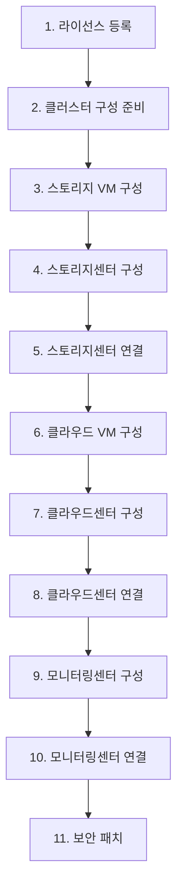
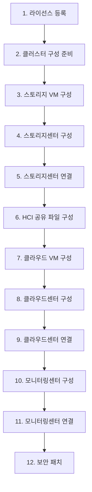
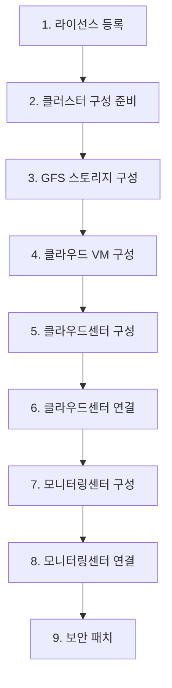
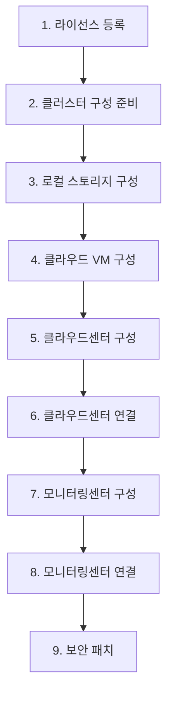

# ABLESTACK 제품 타입별 API 흐름 정리

작성일: 2026-06-01

이 문서는 API 작업자와 UI 작업자가 설치 흐름을 맞추기 위한 임시 정리 문서이다. 기준 코드는 현재 `ablestack-API`의 실제 Gin route와 handler이며, 기본 API prefix는 아래와 같다.

```text
http://<ablecube-ip>:8090/api/v1
```

운영 API는 라이선스 등록 이후 `Authorization: Bearer <token>` 헤더를 붙여 호출하는 것을 전제로 한다. 최초 라이선스 등록과 라이선스 상태 조회는 토큰 없이 호출할 수 있다.

## 공통 원칙

### UI 상태 판단

UI는 매 단계 후 아래 API를 우선 조회해서 현재 진행 단계를 갱신한다.

```http
GET /cube/deploy/status
```

응답의 핵심 필드는 `data.os_type`, `data.stage`, `data.stage_order`, `data.available_actions`, `data.raw`이다. 개별 상세 화면은 필요한 상태 API를 추가로 호출한다.

```http
GET  /cube/cluster/config
GET  /cube/system/config
GET  /cube/cluster/health?option=host,scvm,ccvm
GET  /cube/scvm/status
GET  /cube/ccvm/status
GET  /cube/gluecluster/status
POST /cube/pcs/control {"action":"status"}
```

주의: 현재 `deploy_status.go` 기준으로 `ablestack-hci-filesystem`은 `bootstrap.scvm=true` 이후 `hci_shared_file_configure`를 `storage_cluster_configure`보다 먼저 반환한다. 사용자가 원하는 화면 순서가 "스토리지센터 구성/연결 -> HCI 공유 파일 구성"이면 UI에서 순서를 보정하거나 API 쪽 stage 계산 순서를 조정해야 한다.

### 완료 플래그

일부 단계는 외부 UI 또는 VM 내부 bootstrap script가 실제 구성을 수행한다. 이 경우 현재 API는 완료 여부를 `systemProfile.bootstrap` 플래그로 관리한다.

```http
POST /cube/system/config
```

대표 body:

```json
{"action":"update","depth1":"bootstrap","depth2":"scvm","value":"true","option":"all"}
{"action":"update","depth1":"bootstrap","depth2":"ccvm","value":"true","option":"all"}
{"action":"update","depth1":"bootstrap","depth2":"wall","value":"true","option":"all"}
{"action":"update","depth1":"bootstrap","depth2":"gfs_configure","value":"true","option":"all"}
{"action":"update","depth1":"bootstrap","depth2":"local_configure","value":"true","option":"all"}
```

`option=all`은 `cluster.json`의 `hosts[].ablecube` 전체에 전파한다. `ablestack-standalone`의 로컬 스토리지 생성은 `/cube/local/manage`가 `local_configure`를 자동 갱신한다.

### 사전 인벤토리 API

설치 마법사에서 NIC, 디스크, host 후보를 보여줄 때 사용한다.

```http
GET /cube/nics?action=detail
GET /cube/disk?action=list
GET /cube/disk?action=gfs
GET /cube/disk?action=rbd
GET /cube/hosts
POST /cube/hba/manage {"action":"list-hba-wwn"}
```

## 제품별 흐름도

### ablestack-hci



| 순서 | 단계 | 주 API | 확인 API | 완료 처리 |
| --- | --- | --- | --- | --- |
| 1 | 라이선스 등록 | `POST /cube/license` | `POST /cube/license {"action":"status"}` | 필요 시 `systemProfile.license.status=true` 반영 |
| 2 | 클러스터 구성 준비 | `POST /cube/cluster/apply {"action":"insert","type":"ablestack-hci"}` | `GET /cube/cluster/config`, `GET /cube/cluster/health?option=host` | 없음 |
| 3 | 스토리지 VM 구성 | 각 host에 `POST /cube/cloudinit/scvm/generate`, `POST /cube/scvm/xml`, `POST /cube/scvm/lifecycle` | `GET /cube/scvm/status`, `POST /cube/cloudinit/status {"target":"scvm"}` | `bootstrap.scvm=true` |
| 4 | 스토리지센터 구성 | SCVM 내부 bootstrap 및 Storage Center UI, 보조로 `POST /cube/glue/config/update` | `GET /cube/gluecluster/status`, `GET /glue/`, `GET /glue/auths` | Glue 상태가 `HEALTH_OK`인지 확인 |
| 5 | 스토리지센터 연결 | `GET /cube/url?option=storageCenter` | 반환 URL 접속 | 없음 |
| 6 | 클라우드 VM 구성 | `POST /cube/cloudinit/ccvm/generate`, `POST /cube/ccvm/xml`, `POST /cube/ccvm/lifecycle {"action":"setup"}` | `GET /cube/ccvm/status`, `POST /cube/pcs/control {"action":"status"}` | 없음 |
| 7 | 클라우드센터 구성 | Cloud Center bootstrap/초기 설정, 보조로 `POST /cube/ccvm/service/control` | `GET /mold`, `GET /mold/ccvm` | `bootstrap.ccvm=true` |
| 8 | 클라우드센터 연결 | `GET /cube/url?option=cloudCenter` | 반환 URL 접속 | 없음 |
| 9 | 모니터링센터 구성 | Wall/Monitoring UI에서 구성 | `GET /cube/url?option=wallCenter` | `bootstrap.wall=true` |
| 10 | 모니터링센터 연결 | `GET /cube/url?option=wallCenter` | 반환 URL 접속 | 없음 |
| 11 | 보안 패치 | `POST /cube/security/patch` | `POST /cube/security/patch {"update_json_file":true}` | `systemProfile.security_patch.status=true` |

### ablestack-hci-filesystem



`ablestack-hci` 흐름에 HCI 공유 파일 구성이 추가된다.

| 순서 | 단계 | 주 API | 확인 API | 완료 처리 |
| --- | --- | --- | --- | --- |
| 1 | 라이선스 등록 | `POST /cube/license` | `POST /cube/license {"action":"status"}` | 필요 시 `systemProfile.license.status=true` 반영 |
| 2 | 클러스터 구성 준비 | `POST /cube/cluster/apply {"action":"insert","type":"ablestack-hci-filesystem"}` | `GET /cube/cluster/config`, `GET /cube/cluster/health?option=host` | 없음 |
| 3 | 스토리지 VM 구성 | 각 host에 SCVM cloud-init/XML/lifecycle | `GET /cube/scvm/status` | `bootstrap.scvm=true` |
| 4 | 스토리지센터 구성 | SCVM bootstrap 및 Storage Center UI, `POST /cube/glue/config/update` | `GET /cube/gluecluster/status` | Glue 상태 확인 |
| 5 | 스토리지센터 연결 | `GET /cube/url?option=storageCenter` | 반환 URL 접속 | 없음 |
| 6 | HCI 공유 파일 구성 | `POST /cube/rbd/manage`, `POST /cube/gfs/manage` 계열 | `GET /cube/gfs/disk/status`, `GET /cube/gfs/resource/status` | `bootstrap.gfs_configure=true` |
| 7 | 클라우드 VM 구성 | CCVM cloud-init/XML/lifecycle | `GET /cube/ccvm/status`, `POST /cube/pcs/control {"action":"status"}` | 없음 |
| 8 | 클라우드센터 구성 | Cloud Center bootstrap/초기 설정 | `GET /mold` | `bootstrap.ccvm=true` |
| 9 | 클라우드센터 연결 | `GET /cube/url?option=cloudCenter` | 반환 URL 접속 | 없음 |
| 10 | 모니터링센터 구성 | Wall/Monitoring UI에서 구성 | `GET /cube/url?option=wallCenter` | `bootstrap.wall=true` |
| 11 | 모니터링센터 연결 | `GET /cube/url?option=wallCenter` | 반환 URL 접속 | 없음 |
| 12 | 보안 패치 | `POST /cube/security/patch` | `POST /cube/security/patch {"update_json_file":true}` | `security_patch.status=true` |

### ablestack-vm



| 순서 | 단계 | 주 API | 확인 API | 완료 처리 |
| --- | --- | --- | --- | --- |
| 1 | 라이선스 등록 | `POST /cube/license` | `POST /cube/license {"action":"status"}` | 필요 시 `systemProfile.license.status=true` 반영 |
| 2 | 클러스터 구성 준비 | `POST /cube/cluster/apply {"action":"insert","type":"ablestack-vm"}` | `GET /cube/cluster/config`, `GET /cube/cluster/health?option=host` | 없음 |
| 3 | GFS 스토리지 구성 | `POST /cube/gfs/manage` 계열 | `GET /cube/gfs/disk/status`, `GET /cube/gfs/resource/status` | `bootstrap.gfs_configure=true` |
| 4 | 클라우드 VM 구성 | `POST /cube/cloudinit/ccvm/generate`, `POST /cube/ccvm/xml`, `POST /cube/ccvm/lifecycle {"action":"setup"}` | `GET /cube/ccvm/status`, `POST /cube/pcs/control {"action":"status"}` | 없음 |
| 5 | 클라우드센터 구성 | Cloud Center bootstrap/초기 설정 | `GET /mold`, `GET /mold/ccvm` | `bootstrap.ccvm=true` |
| 6 | 클라우드센터 연결 | `GET /cube/url?option=cloudCenter` | 반환 URL 접속 | 없음 |
| 7 | 모니터링센터 구성 | Wall/Monitoring UI에서 구성 | `GET /cube/url?option=wallCenter` | `bootstrap.wall=true` |
| 8 | 모니터링센터 연결 | `GET /cube/url?option=wallCenter` | 반환 URL 접속 | 없음 |
| 9 | 보안 패치 | `POST /cube/security/patch` | `POST /cube/security/patch {"update_json_file":true}` | `security_patch.status=true` |

주의: 현재 `/cube/gfs/manage`는 GFS 신규 생성 전체를 끝내는 단일 API가 아니라 PCS/GFS 관련 초기화, LVM 설정, scan/rescan, extend, 상태 확인 중심이다. `mkfs.gfs2`, PCS Filesystem 리소스 신규 생성 같은 흐름은 현재 코드에서 명확한 생성 action이 보이지 않는다. VM용 GFS 최초 생성 전체를 API로 닫으려면 추가 API 또는 외부 구성 절차가 필요하다.

### ablestack-standalone



| 순서 | 단계 | 주 API | 확인 API | 완료 처리 |
| --- | --- | --- | --- | --- |
| 1 | 라이선스 등록 | `POST /cube/license` | `POST /cube/license {"action":"status"}` | 필요 시 `systemProfile.license.status=true` 반영 |
| 2 | 클러스터 구성 준비 | `POST /cube/cluster/apply {"action":"insert","type":"ablestack-standalone"}` | `GET /cube/cluster/config`, `GET /cube/cluster/health?option=host` | 없음 |
| 3 | 로컬 스토리지 구성 | `POST /cube/local/manage {"action":"create-local-disk"}` | `POST /cube/local/manage {"action":"local-disk-status"}` | API가 `local_configure=true` 자동 반영 |
| 4 | 클라우드 VM 구성 | `POST /cube/cloudinit/ccvm/generate`, `POST /cube/ccvm/xml`, `POST /cube/ccvm/lifecycle {"action":"setup"}` | `GET /cube/ccvm/status` | 없음 |
| 5 | 클라우드센터 구성 | Cloud Center bootstrap/초기 설정 | `GET /mold`, `GET /mold/ccvm` | `bootstrap.ccvm=true` |
| 6 | 클라우드센터 연결 | `GET /cube/url?option=cloudCenter` | 반환 URL 접속 | 없음 |
| 7 | 모니터링센터 구성 | Wall/Monitoring UI에서 구성 | `GET /cube/url?option=wallCenter` | `bootstrap.wall=true` |
| 8 | 모니터링센터 연결 | `GET /cube/url?option=wallCenter` | 반환 URL 접속 | 없음 |
| 9 | 보안 패치 | `POST /cube/security/patch` | `POST /cube/security/patch {"update_json_file":true}` | `security_patch.status=true` |

## 단계별 API 사용 예시

아래 예시는 body 형태와 호출 순서를 맞추기 위한 샘플이다. 실제 IP, NIC, disk, bridge, size 값은 UI 입력값으로 치환한다.

### 1. 라이선스 등록

```http
POST /cube/license
Content-Type: application/json

{
  "action": "register",
  "license_content": "BASE64_CONTENT",
  "original_filename": "license.lic"
}
```

상태 확인:

```http
POST /cube/license
Content-Type: application/json

{"action":"status"}
```

현재 license API는 라이선스 파일 등록/검증을 수행하지만 `systemProfile.license.status`를 직접 갱신하지 않는다. `/cube/deploy/status`의 `raw.license_status`를 화면에 쓰려면 아래 호출 또는 API 개선이 필요하다.

```http
POST /cube/system/config
Content-Type: application/json

{"action":"update","depth1":"license","depth2":"status","value":"true"}
```

라이선스 단계는 보통 클러스터 구성 전에 수행되므로 `option=all`을 붙이지 않는다. 클러스터 구성이 끝난 뒤 전체 노드에 같은 상태값을 맞춰야 하는 경우에만 `option=all`을 붙인다.

### 2. 클러스터 구성 준비

HCI/HCI-filesystem:

```http
POST /cube/cluster/apply
Content-Type: application/json

{
  "action": "insert",
  "option": "add",
  "type": "ablestack-hci",
  "ccvm": {
    "ip": "10.10.12.10"
  },
  "mngtNic": {
    "cidr": "16",
    "gw": "10.10.0.1",
    "dns": "8.8.8.8"
  },
  "external_timeserver": "time.google.com",
  "storage_network": "false",
  "pcs_cluster_list": ["10.10.12.1", "10.10.12.2", "10.10.12.3"],
  "hosts": [
    {
      "index": "1",
      "hostname": "ablecube12-1",
      "ablecube": "10.10.12.1",
      "scvmMngt": "10.10.12.11",
      "ablecubePn": "100.100.12.1",
      "scvm": "100.100.12.11",
      "scvmCn": "100.200.12.11"
    },
    {
      "index": "2",
      "hostname": "ablecube12-2",
      "ablecube": "10.10.12.2",
      "scvmMngt": "10.10.12.12",
      "ablecubePn": "100.100.12.2",
      "scvm": "100.100.12.12",
      "scvmCn": "100.200.12.12"
    },
    {
      "index": "3",
      "hostname": "ablecube12-3",
      "ablecube": "10.10.12.3",
      "scvmMngt": "10.10.12.13",
      "ablecubePn": "100.100.12.3",
      "scvm": "100.100.12.13",
      "scvmCn": "100.200.12.13"
    }
  ]
}
```

`ablestack-hci-filesystem`은 위 body에서 `type`만 `ablestack-hci-filesystem`으로 변경한다.

VM:

```http
POST /cube/cluster/apply
Content-Type: application/json

{
  "action": "insert",
  "option": "add",
  "type": "ablestack-vm",
  "ccvm": {
    "ip": "10.10.31.10"
  },
  "mngtNic": {
    "cidr": "16",
    "gw": "10.10.0.1",
    "dns": "8.8.8.8"
  },
  "external_timeserver": "time.google.com",
  "storage_network": "false",
  "pcs_cluster_list": ["10.10.31.1"],
  "hosts": [
    {
      "index": "1",
      "hostname": "ablecube31-1",
      "ablecube": "10.10.31.1"
    }
  ]
}
```

Standalone:

```http
POST /cube/cluster/apply
Content-Type: application/json

{
  "action": "insert",
  "option": "add",
  "type": "ablestack-standalone",
  "ccvm": {
    "ip": "10.10.41.10"
  },
  "mngtNic": {
    "cidr": "16",
    "gw": "10.10.0.1",
    "dns": "8.8.8.8"
  },
  "external_timeserver": "time.google.com",
  "storage_network": "false",
  "hosts": [
    {
      "index": "1",
      "hostname": "ablecube41-1",
      "ablecube": "10.10.41.1"
    }
  ]
}
```

확인:

```http
GET /cube/cluster/config
GET /cube/cluster/health?option=host
GET /cube/deploy/status
```

### 3. 스토리지 VM 구성, HCI 계열

SCVM cloud-init과 XML 생성은 현재 노드 기준으로 동작한다. 따라서 UI가 한 노드에서 전체를 오케스트레이션하려면 `hosts[].ablecube`를 순회하면서 각 host의 API에 직접 호출해야 한다.

각 ablecube host에서 cloud-init 생성:

```http
POST /cube/cloudinit/scvm/generate
```

SCVM XML 생성:

```http
POST /cube/scvm/xml
Content-Type: application/json

{
  "cpu": 4,
  "memory": 16,
  "disk_type": "disk_passthrough",
  "disk_passthrough_list": ["/dev/disk/by-id/wwn-0x1234"],
  "management_network_bridge": "br0",
  "storage_traffic_network_type": "bridge",
  "server_network_bridge": "br1",
  "replication_network_bridge": "br2"
}
```

SCVM lifecycle:

```http
POST /cube/scvm/lifecycle
Content-Type: application/json

{"action":"setup","target_hostname":"ablecube12-1"}
```

```http
POST /cube/scvm/lifecycle
Content-Type: application/json

{"action":"start","target_hostname":"ablecube12-1"}
```

상태 확인:

```http
GET  /cube/scvm/status
POST /cube/cloudinit/status {"action":"ping","target":"scvm"}
POST /cube/cloudinit/status {"action":"status","target":"scvm"}
GET  /cube/deploy/status
```

SCVM bootstrap이 끝났다고 판단되면:

```http
POST /cube/system/config
Content-Type: application/json

{"action":"update","depth1":"bootstrap","depth2":"scvm","value":"true","option":"all"}
```

### 4. 스토리지센터 구성/연결, HCI 계열

스토리지센터 구성 자체는 SCVM 내부의 `scvm_bootstrap.sh`와 Storage Center UI가 중심이다. API는 URL 제공, 상태 조회, Ceph 설정 동기화를 담당한다.

Ceph/Glue 설정 동기화:

```http
POST /cube/glue/config/update
Content-Type: application/json

{"action":"update"}
```

상태 확인:

```http
GET /cube/gluecluster/status
GET /glue/
GET /glue/auths
GET /glue/auth/client.admin
```

스토리지센터 연결 URL:

```http
GET /cube/url?option=storageCenter
```

### 5. HCI 공유 파일 구성, HCI-filesystem

현재 API에서 HCI 공유 파일 구성은 RBD 이미지 관리와 GFS/PCS 관리 API를 조합한다.

Ceph 설정 동기화:

```http
POST /cube/glue/config/update
Content-Type: application/json

{"action":"update"}
```

GFS용 RBD 이미지 생성:

```http
POST /cube/rbd/manage
Content-Type: application/json

{
  "action": "create",
  "size": 5000,
  "pool_name": "rbd",
  "image_prefix": "gfs"
}
```

GFS host 준비/상태:

```http
POST /cube/gfs/manage {"action":"check-host"}
POST /cube/gfs/manage {"action":"scan"}
POST /cube/gfs/manage {"action":"lvmdevices-add","disks":["/dev/rbd/rbd/gfs01"]}
POST /cube/gfs/manage {"action":"set-alert"}
GET  /cube/gfs/disk/status
GET  /cube/gfs/resource/status
```

구성이 끝났다고 판단되면:

```http
POST /cube/system/config
Content-Type: application/json

{"action":"update","depth1":"bootstrap","depth2":"gfs_configure","value":"true","option":"all"}
```

주의: 위 API들은 공유 파일 구성을 위한 주변 작업이다. 현재 코드에는 GFS2 파일시스템 신규 생성과 PCS Filesystem 리소스 생성을 한 번에 수행하는 명확한 create action이 없다.

### 6. GFS 스토리지 구성, VM

VM 타입에서는 Cloud Center VM 디스크가 `/mnt/glue-gfs/ccvm.qcow2`를 사용하므로, CCVM 구성 전에 GFS mount point가 정상이어야 한다.

권장 확인/준비 API:

```http
GET  /cube/disk?action=gfs
POST /cube/hba/manage {"action":"list-hba-wwn"}
POST /cube/gfs/manage {"action":"check-host"}
POST /cube/gfs/manage {"action":"check-stonith","control":"check"}
POST /cube/gfs/manage {"action":"check-ipmi","stonith":[{"ipaddr":"192.168.0.10","ipport":"623","login":"admin","passwd":"password"}]}
POST /cube/gfs/manage {"action":"modify-lvm-conf","use_lvmlockd":true}
POST /cube/gfs/manage {"action":"scan"}
POST /cube/gfs/manage {"action":"lvmdevices-add","disks":["/dev/sdb"]}
POST /cube/gfs/manage {"action":"set-alert"}
GET  /cube/gfs/disk/status
GET  /cube/gfs/resource/status
```

기존 GFS 초기화/정리:

```http
POST /cube/gfs/manage
Content-Type: application/json

{
  "action": "init-pcs-cluster",
  "disks": ["/dev/sdb"],
  "volume_groups": [
    {
      "vg_name": "vg_glue",
      "lv_name": "lv_glue"
    }
  ]
}
```

구성이 완료되면:

```http
POST /cube/system/config
Content-Type: application/json

{"action":"update","depth1":"bootstrap","depth2":"gfs_configure","value":"true","option":"all"}
```

주의: 현재 API만으로 VM GFS 최초 생성 전체가 닫히는지 확인이 필요하다. `/cube/gfs/manage`는 `init`, `scan`, `extend`, `delete`, `status` 계열은 있지만 신규 GFS 생성 전용 action은 없다.

### 7. 로컬 스토리지 구성, Standalone

디스크 후보 조회:

```http
GET /cube/disk?action=list
```

로컬 디스크 생성:

```http
POST /cube/local/manage
Content-Type: application/json

{
  "action": "create-local-disk",
  "disks": ["/dev/sdb"]
}
```

상태 확인:

```http
POST /cube/local/manage
Content-Type: application/json

{"action":"local-disk-status"}
```

`create-local-disk` 성공 시 `/mnt/glue`에 XFS를 구성하고 `bootstrap.local_configure=true`를 자동 반영한다.

### 8. 클라우드 VM 구성

CCVM cloud-init 생성:

```http
POST /cube/cloudinit/ccvm/generate
Content-Type: application/json

{}
```

서비스 네트워크가 별도로 있으면:

```http
POST /cube/cloudinit/ccvm/generate
Content-Type: application/json

{
  "sn_nic": "enp0s21",
  "sn_ip": "172.16.31.10",
  "sn_prefix": 24,
  "sn_gw": "172.16.31.1",
  "sn_dns": "8.8.8.8"
}
```

CCVM XML 생성, HCI/HCI-filesystem:

```http
POST /cube/ccvm/xml
Content-Type: application/json

{
  "cpu": 4,
  "memory": 16,
  "management_network_bridge": "br0",
  "service_network_bridge": "br1"
}
```

CCVM XML 생성, VM:

```http
POST /cube/ccvm/xml
Content-Type: application/json

{
  "cpu": 4,
  "memory": 16,
  "gfs_mount_point": "/mnt/glue-gfs",
  "management_network_bridge": "br0",
  "service_network_bridge": "br1"
}
```

CCVM XML 생성, Standalone:

```http
POST /cube/ccvm/xml
Content-Type: application/json

{
  "cpu": 4,
  "memory": 16,
  "management_network_bridge": "br0",
  "service_network_bridge": "br1"
}
```

CCVM setup/start:

```http
POST /cube/ccvm/lifecycle
Content-Type: application/json

{"action":"setup"}
```

```http
POST /cube/ccvm/lifecycle
Content-Type: application/json

{"action":"start"}
```

상태 확인:

```http
GET  /cube/ccvm/status
POST /cube/cloudinit/status {"action":"ping","target":"ccvm"}
POST /cube/cloudinit/status {"action":"status","target":"ccvm"}
POST /cube/pcs/control {"action":"status"}
GET  /cube/deploy/status
```

`/cube/ccvm/lifecycle {"action":"setup"}`는 HCI/VM/HCI-filesystem에서 PCS 설정까지 포함하는 상위 API다. `/cube/pcs/control`은 주로 상태 확인, 이동, cleanup, 수동 제어에 사용한다.

### 9. 클라우드센터 구성/연결

클라우드센터 접속 URL:

```http
GET /cube/url?option=cloudCenter
```

서비스 상태 제어:

```http
POST /cube/ccvm/service/control
Content-Type: application/json

{"action":"status","service_name":"mold"}
```

```http
POST /cube/ccvm/service/control
Content-Type: application/json

{"action":"restart","service_name":"mold"}
```

상태 조회:

```http
GET /mold
GET /mold/ccvm
POST /cube/pcs/control {"action":"status"}
```

Cloud Center bootstrap/초기 설정이 끝났으면:

```http
POST /cube/system/config
Content-Type: application/json

{"action":"update","depth1":"bootstrap","depth2":"ccvm","value":"true","option":"all"}
```

### 10. 모니터링센터 구성/연결

현재 API에서 모니터링센터는 별도 구성 API가 아니라 Wall Center URL 제공과 완료 플래그 갱신으로 연결된다.

모니터링센터 URL:

```http
GET /cube/url?option=wallCenter
```

구성이 끝났으면:

```http
POST /cube/system/config
Content-Type: application/json

{"action":"update","depth1":"bootstrap","depth2":"wall","value":"true","option":"all"}
```

### 11. 보안 패치

기본 실행:

```http
POST /cube/security/patch
Content-Type: application/json

{
  "targets": ["all"],
  "ssh_user": "root",
  "ssh_port": 22
}
```

SSH 포트 변경까지 포함:

```http
POST /cube/security/patch
Content-Type: application/json

{
  "targets": ["all"],
  "ssh_user": "root",
  "ssh_port": 22,
  "port_change": true,
  "new_port": 10022
}
```

Ceph SSH 설정 변경:

```http
POST /cube/security/patch
Content-Type: application/json

{
  "ceph_ssh_change": true,
  "new_port": 10022
}
```

실행 성공 후 `security_patch.status` 반영:

```http
POST /cube/security/patch
Content-Type: application/json

{
  "update_json_file": true,
  "local": false
}
```

## 화면 액션과 API 매핑

| UI 액션 | API |
| --- | --- |
| 현재 단계 조회 | `GET /cube/deploy/status` |
| 라이선스 등록 | `POST /cube/license {"action":"register"}` |
| 클러스터 구성 준비 | `POST /cube/cluster/apply {"action":"insert"}` |
| 구성 초기화 | `POST /cube/cluster/apply {"action":"reset"}` |
| 호스트 health 확인 | `GET /cube/cluster/health?option=host` |
| SCVM 배포 | `POST /cube/cloudinit/scvm/generate`, `POST /cube/scvm/xml`, `POST /cube/scvm/lifecycle` |
| SCVM 상태 | `GET /cube/scvm/status` |
| 스토리지센터 열기 | `GET /cube/url?option=storageCenter` |
| Glue 상태 | `GET /cube/gluecluster/status`, `GET /glue/` |
| Glue 설정 동기화 | `POST /cube/glue/config/update` |
| HCI 공유 파일/RBD | `POST /cube/rbd/manage`, `POST /cube/gfs/manage` |
| VM GFS 상태 | `GET /cube/gfs/disk/status`, `GET /cube/gfs/resource/status` |
| Standalone 로컬 스토리지 | `POST /cube/local/manage` |
| CCVM 배포 | `POST /cube/cloudinit/ccvm/generate`, `POST /cube/ccvm/xml`, `POST /cube/ccvm/lifecycle` |
| CCVM 상태 | `GET /cube/ccvm/status` |
| Cloud Center PCS 상태 | `POST /cube/pcs/control {"action":"status"}` |
| Cloud Center 열기 | `GET /cube/url?option=cloudCenter` |
| Mold 상태 | `GET /mold`, `GET /mold/ccvm` |
| Monitoring Center 열기 | `GET /cube/url?option=wallCenter` |
| 완료 플래그 갱신 | `POST /cube/system/config {"action":"update",...}` |
| 보안 패치 | `POST /cube/security/patch` |

## 현재 API 기준 보완 필요 지점

1. `POST /cube/license {"action":"register"}` 성공이 `systemProfile.license.status`를 자동으로 갱신하지 않는다. `/cube/deploy/status`의 `license_status`와 실제 라이선스 상태가 어긋날 수 있다.
2. SCVM/CCVM bootstrap 완료는 VM 내부 script 실행 결과와 연결되어야 하지만, 현재는 `systemProfile.bootstrap.scvm`, `systemProfile.bootstrap.ccvm`을 별도 API로 갱신해야 한다.
3. 모니터링센터 구성은 전용 구성 API가 없고 `wallCenter` URL과 `bootstrap.wall` 플래그 중심이다.
4. VM/HCI-filesystem의 GFS 신규 생성 전체를 닫는 전용 create API가 현재 명확하지 않다. UI에서 이 단계를 API만으로 처리하려면 GFS 생성 API를 추가하거나 외부 구성 절차를 명시해야 한다.
5. `ablestack-hci-filesystem`의 `/cube/deploy/status` stage 순서가 사용자가 원하는 문서상 순서와 다를 수 있다.
